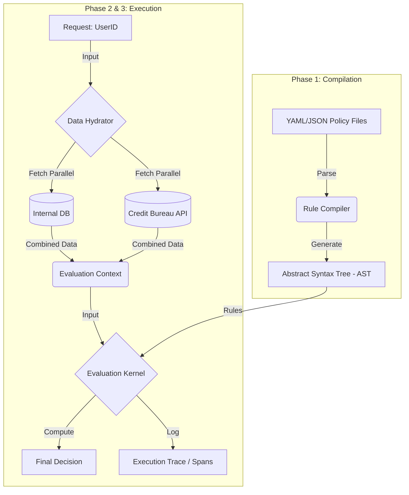

# ADR-001: OpenDecision Engine - Core Architecture & Roadmap

| Metadata | Details |
| :--- | :--- |
| **ADR ID** | opendecision-001 |
| **Status** | Complete |
| **Date** | 2025-12-11 |
| **Authors** | @marcusborges1 |
| **Language** | Go (Golang) |
| **License** | Apache 2.0 |
| **Objective** | Decouple business logic from application code using a stateless decision engine. |

---

## 1. Problem Statement

On small fintech startups, the business policies (Credit, Fraud, KYC) are usually hard-coded into the application layer. This coupling creates several critical issues:

* **Velocity:** Changing a threshold (e.g., `min_score` from 600 to 620) requires a code commit, PR review, and full deployment cycle.
* **Opacity:** Usually, it is difficult to answer "Why was User X rejected?" without digging through raw logs or reading source code.
* **Dependency:** Risk Analysts are dependent on Engineering availability to test or iterate on strategies.

## 2. The Solution: OpenDecision

We will build a high-performance, open-source decision engine written in Go. The system treats **Logic as Data**. The engine executes rules defined in configuration files (and later databases), hydrates data from external sources, and returns a decision with a full execution trace.

### 2.1 Guiding Principles

1.  **Safety First:** The rule evaluation environment must be sandboxed. No rule should be able to crash the binary or access the host OS. We will use **[CEL (Common Expression Language)](https://cel.dev/)**.
2.  **Observability by Default:** Every decision must return a "Trace" explaining exactly which variables were fetched and which rules passed/failed.
3.  **Stateless Core:** The core engine is a pure function: `f(Context, Rules) = Decision`.
4.  **Performance:** Utilize Go’s concurrency (`goroutines`, `errgroup`) for parallel data fetching.

## 3. Architecture Overview

The system is composed of three lifecycle stages: **Compilation**, **Hydration**, and **Evaluation**.



## 4. Phased Roadmap

We will adopt an iterative approach, starting with a MVP and moving to the Platform.

### Phase 1: The "Stateless Lib" (Current Focus)
**Goal:** A pure Go library that runs logic on a provided JSON map.
* **Input:** A JSON payload containing all necessary data.
* **Config:** Local YAML files defining the rules.
* **Output:** Pass/Fail boolean, list of hit rules, and rule execution timings.
* **Out of Scope:** Database, API, UI, Data Fetching.

### Phase 2: The "Hydrator"
**Goal:** The engine learns to fetch its own data.
* **Feature:** Define `DataSources` via Go interfaces.
* **Feature:** Parallel fetching using `errgroup`.
* **Change:** Input is simplified to an ID (e.g., `user_id`); the engine fetches the attributes.

### Phase 3: The "Service"
**Goal:** Deployable HTTP Server (Dockerized).
* **Feature:** REST/gRPC API.
* **Feature:** Structured Logging (TraceID propagation) using OpenTelemetry.
* **Feature:** "Dry Run" endpoint for testing rules without saving results.

### Phase 4: The "Platform"
**Goal:** UI and Management Plane.
* **Feature:** Versioning of rules in Postgres.
* **Feature:** React/Next.js UI for Risk Analysts to draft and publish rules.

---

## 5. Technical Specification (Phase 1)

### 5.1 The Logic Language: Google CEL
We will use **Google CEL (Common Expression Language)** `google/cel-go`.
* **Why:** It is non-Turing complete (safe), fast, supports JSON natively, and is the standard used in Kubernetes and Istio.
* **Example:** `input.age >= 18 && input.risk_score < 0.5`

### 5.2 Configuration Structure (YAML)

```yaml
name: "personal_loan_v1"
description: "Initial credit check for personal loans"
default_decision: "reject"

variables:
  - name: "debt_to_income"
    expression: "input.total_debt / input.annual_income"

rules:
  - id: "must_be_adult"
    description: "User must be over 18"
    condition: "input.age >= 18"
    effect: "permit"

  - id: "low_dti"
    description: "DTI must be healthy"
    condition: "variables.debt_to_income < 0.40"
    effect: "permit"

  - id: "no_active_fraud_flags"
    description: "Check internal blacklist"
    condition: "!('fraud' in input.tags)"
    effect: "permit"
```

### 5.3 Core Go Interfaces

**The Engine Interface:**
```go
type Engine interface {
    // Evaluate takes a context (data) and a policy name, returning the result
    Evaluate(ctx context.Context, policyName string, data map[string]interface{}) (*Decision, error)
}
```

**The Decision Struct:**
```go
type Decision struct {
    PolicyID      string
    Decision      string // "APPROVE", "REJECT", "MANUAL_REVIEW"
    TraceID       string
    Timestamp     time.Time
    // The "Why" - crucial for debugging
    RuleResults   []RuleResult
    ComputedVars  map[string]interface{}
}

type RuleResult struct {
    RuleID    string
    Passed    bool
    Error     error
    Duration  time.Duration // How long this specific rule took to calculate
}
```

---

## 6. Open Points for Discussion

The following items require team alignment before implementation:

1.  **Logic Flow (Sequential vs. DAG):**
    * *Proposal:* Start with **Sequential** (Top-to-bottom) for Phase 1. If any rule with `effect: deny` is hit, we fail.
2.  **Data Typing:**
    * *Issue:* JSON numbers are `float64`. Logic might expect `int`.
    * *Proposal:* Rely on CEL's dynamic typing but enforce schema validation at the API boundary later.
3.  **Rule Storage:**
    * *Phase 1:* Local Filesystem (watched for changes via `fsnotify`).
    * *Phase 4:* Postgres.

## 7. Next Steps

1.  [ ] **PoC:** Create `cmd/poc/main.go` to parse the YAML example and run it against `cel-go`.